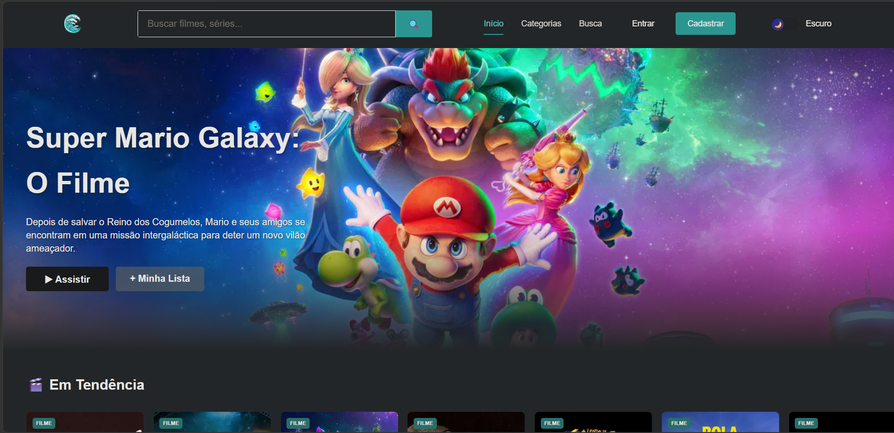

# 🎬 Cine-Wave

> Uma aplicação web moderna para catálogo de filmes, desenvolvida com **React**.  
> 🔗 **Demo ao vivo**: [https://mireleloureiro.github.io/cine-wave/](https://mireleloureiro.github.io/cine-wave/)



## 🚀 Funcionalidades
- 📺 Catálogo dinâmico com renderização assíncrona de dados
- 🔍 Busca e filtros para navegação rápida
- 📱 Layout 100% responsivo (mobile, tablet e desktop)
- ⚡ Gerenciamento de estado com React Hooks (`useState`, `useEffect`)
- 🧩 Arquitetura baseada em componentes reutilizáveis
- 🛣️ Roteamento cliente-side com React Router DOM

## 🛠️ Tecnologias Utilizadas
| Categoria | Stack |
|-----------|-------|
| **Frontend** | React, JavaScript (ES6+), HTML5, CSS3 |
| **Roteamento** | React Router DOM |
| **API** | Fetch API + RESTful API externa (TMDB/Omdb) |
| **Build Tool** | Create React App |
| **Deploy** | GitHub Pages |
| **Ferramentas** | Git, GitHub, VS Code, npm |

## 📦 Como Executar Localmente

### Pré-requisitos
- Node.js (v16 ou superior)
- npm

### Instalação
```bash
# 1. Clone o repositório
git clone https://github.com/MireleLoureiro/cine-wave.git
cd cine-wave

# 2. Instale as dependências
npm install

# 3. Inicie o servidor de desenvolvimento
npm start
